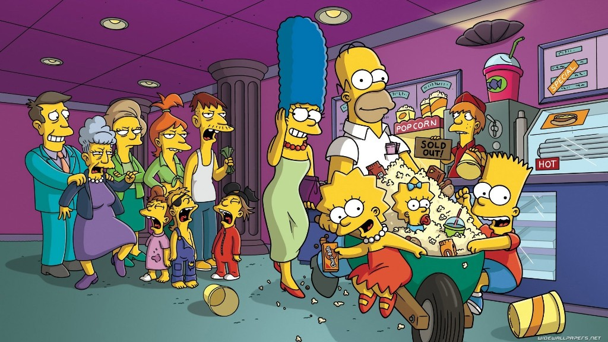
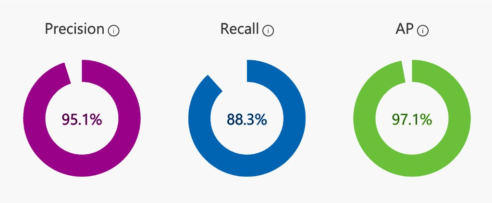
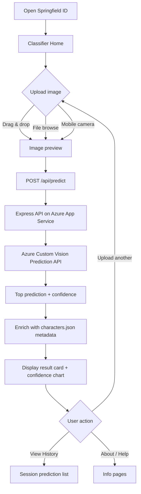
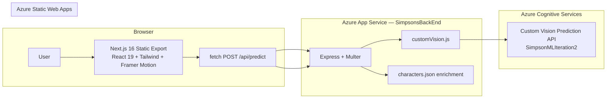

<div align="center">

# Springfield ID

### Know Your Springfield Resident.

**Upload a Simpsons image. Get an instant AI identification with confidence scores and character bios.**

[](https://icy-moss-06fa2b400.7.azurestaticapps.net/)
[](https://nextjs.org/)
[](https://react.dev/)
[](https://expressjs.com/)
[](https://azure.microsoft.com/products/ai-services/ai-custom-vision)
[](https://www.typescriptlang.org/)
[](https://tailwindcss.com/)

**[Try it live →](https://icy-moss-06fa2b400.7.azurestaticapps.net/)** · **[View source →](https://github.com/LakiyaDev/SpringfieldID-Simpsons-Character-Classification-ML-Model)**

<p align="center">
  
</p>

</div>

---

## Table of Contents

- [Overview](#overview)
- [Model Performance](#model-performance)
- [Key Features](#key-features)
- [Live Demo Flow](#live-demo-flow)
- [Architecture](#architecture)
- [Tech Stack](#tech-stack)
- [Quick Start](#quick-start)
- [Environment Variables](#environment-variables)
- [API Reference](#api-reference)
- [Project Structure](#project-structure)
- [Available Scripts](#available-scripts)
- [Deployment](#deployment)
- [Troubleshooting](#troubleshooting)
- [Author](#author)
- [License](#license)

---


## Overview

**Springfield ID** is a full-stack AI portfolio project that identifies *The Simpsons* characters from uploaded images. Users drag in a photo (or capture one on mobile), and the app returns the predicted character, a top-5 confidence breakdown, and rich metadata — occupation, family, personality traits, and iconic quotes.

The product demonstrates end-to-end ML deployment on Azure:

1. **Train** a Custom Vision multiclass model on tagged Simpsons images
2. **Publish** the model to an Azure Prediction resource
3. **Serve** predictions through a Node.js / Express API on Azure App Service
4. **Present** results in a static-export Next.js frontend on Azure Static Web Apps

The model (**SimpsonMLIteration2**) was trained on the [Kaggle Simpsons Characters Dataset](https://www.kaggle.com/datasets/alexattia/the-simpsons-characters-dataset) and recognizes **20+ Springfield residents** across **21 classification tags**.

---


## Model Performance

Published iteration metrics from Azure Custom Vision (**SimpsonMLIteration2**):

<p align="center">
  
</p>

| Metric | Score | Meaning |
|--------|-------|---------|
| **Precision** | 95.1% | When the model predicts a character, it is correct 95.1% of the time |
| **Recall** | 88.3% | The model finds 88.3% of all actual instances of each character |
| **Average Precision** | 97.1% | Overall model quality across all classes and thresholds |

Eight characters achieved **100% precision**; three reached perfect precision, recall, and AP scores. See the [About page](https://icy-moss-06fa2b400.7.azurestaticapps.net/about) on the live site for per-character breakdowns.

---


## Key Features

- **Instant classification** — Upload triggers automatic analysis; no extra button click required
- **Top-5 confidence chart** — Visual bar breakdown of alternative predictions
- **Character enrichment** — Bios, quotes, occupation, and family from `characters.json`
- **Session history** — Revisit past identifications stored in the browser
- **Mobile camera capture** — `capture="environment"` for on-the-go photos
- **Azure health indicator** — Live status of backend / Custom Vision configuration
- **Glassmorphism UI** — Animated Springfield sky, Framer Motion transitions, light/dark theme
- **Fully responsive** — Optimized layouts for mobile, tablet, and desktop
- **Static export** — Fast global delivery via Azure Static Web Apps
- **CI/CD** — GitHub Actions deploy frontend and backend on push to `main`


### Pages


| Page                     | Description                                 |
| ------------------------ | ------------------------------------------- |
| **Classifier** (`/`)     | Main upload and results experience          |
| **About** (`/about`)     | Model metrics, tech stack, dataset info     |
| **Help** (`/help`)       | Usage guide, accuracy tips, troubleshooting |
| **Contact** (`/contact`) | Author links and social profiles            |
| **Privacy** / **Terms**  | Legal pages                                 |


---


## Live Demo Flow




---


## Architecture

Springfield ID is a decoupled frontend and API. The Next.js app is a static export (no server runtime); all ML inference happens in the Express backend, which proxies image bytes to Azure Custom Vision.




**Request path:**

```
Browser  →  SWA (static files)  →  App Service  →  Custom Vision  →  JSON response
```

---


## Tech Stack


| Layer     | Technology                                                                                                      |
| --------- | --------------------------------------------------------------------------------------------------------------- |
| Framework | Next.js 16 (App Router, React 19, static export)                                                                |
| Language  | TypeScript 5 (frontend), JavaScript (backend)                                                                   |
| Styling   | Tailwind CSS v4, Framer Motion 12                                                                               |
| Backend   | Node.js 20+, Express 4, Multer, Axios                                                                           |
| AI / ML   | Azure Custom Vision — multiclass image classification                                                           |
| Model     | SimpsonMLIteration2 · General [A2] domain                                                                       |
| Dataset   | [Kaggle Simpsons Characters Dataset](https://www.kaggle.com/datasets/alexattia/the-simpsons-characters-dataset) |
| Cloud     | Azure Static Web Apps, Azure App Service, Azure Cognitive Services                                              |
| CI/CD     | GitHub Actions (OIDC deploy to Azure)                                                                           |


---


## Quick Start


### Prerequisites

- Node.js ≥ 20
- npm ≥ 10
- An [Azure Custom Vision](https://www.customvision.ai/) project with a published prediction iteration
- Prediction resource **Key** and **Endpoint**


### Setup

```bash
git clone https://github.com/LakiyaDev/SpringfieldID-Simpsons-Character-Classification-ML-Model.git
cd SpringfieldID-Simpsons-Character-Classification-ML-Model

cp backend/.env.example backend/.env
# Edit backend/.env with your Azure credentials

npm run install:all
npm install
```


### Run

From the repo root:

```bash
npm run dev
```

Or in separate terminals:

```bash
# Terminal 1 — backend (port 5001)
cd backend && npm run dev

# Terminal 2 — frontend (port 3000)
cd frontend && npm run dev
```

- Frontend: [http://localhost:3000](http://localhost:3000)
- Backend: [http://localhost:5001](http://localhost:5001)
- Health: [http://localhost:5001/api/predict/health](http://localhost:5001/api/predict/health)

> On macOS, port 5000 is often taken by AirPlay. This project defaults to **port 5001** for the backend.


### Test the API

```bash
curl -X POST http://localhost:5001/api/predict \
  -F "image=@/path/to/homer.jpg"

curl http://localhost:5001/api/predict/health
```

---


## Environment Variables


### Backend (`backend/.env`)


| Variable                 | Purpose                                                |
| ------------------------ | ------------------------------------------------------ |
| `PREDICTION_KEY`         | Key from Azure **Prediction** resource (not Training)  |
| `CUSTOM_VISION_ENDPOINT` | Prediction resource endpoint URL                       |
| `PROJECT_ID`             | Custom Vision project GUID                             |
| `PUBLISHED_NAME`         | Published iteration name (e.g. `SimpsonMLIteration2`)  |
| `PORT`                   | Server port (default `5001`)                           |
| `FRONTEND_URL`           | Allowed CORS origin (local or production frontend URL) |


See `[backend/.env.example](backend/.env.example)` for the canonical list.

### Frontend (build-time)


| Variable               | Local                   | Production                |
| ---------------------- | ----------------------- | ------------------------- |
| `NEXT_PUBLIC_API_URL`  | `http://localhost:5001` | Azure App Service API URL |
| `NEXT_PUBLIC_SITE_URL` | `http://localhost:3000` | SWA production URL        |


Production values are set in `[.github/workflows/azure-static-web-apps-icy-moss-06fa2b400.yml](.github/workflows/azure-static-web-apps-icy-moss-06fa2b400.yml)` and baked in at build time.

---


## API Reference


### `POST /api/predict`

Upload an image for classification.

**Request:** `multipart/form-data` with field `image` (JPG, PNG, WEBP — max 10 MB)

**Response:**

```json
{
  "character": "Homer Simpson",
  "tagName": "Homer Simpson",
  "confidence": 98.7,
  "predictions": [
    { "tagName": "Homer Simpson", "probability": 0.987, "confidence": 98.7 },
    { "tagName": "Barney Gumble", "probability": 0.008, "confidence": 0.8 }
  ],
  "metadata": {
    "displayName": "Homer Simpson",
    "occupation": "Nuclear Safety Inspector",
    "quote": "D'oh!",
    "color": "#FFD90F"
  }
}
```


### `GET /api/predict/health`

```json
{ "status": "ok", "azureConfigured": true }
```


### Azure Custom Vision (internal)

```
POST {CUSTOM_VISION_ENDPOINT}/customvision/v3.0/Prediction/{PROJECT_ID}/classify/iterations/{PUBLISHED_NAME}/image
```

Headers: `Prediction-Key`, `Content-Type: application/octet-stream`

---


## Project Structure

```
.
├── .github/workflows/
│   ├── azure-static-web-apps-icy-moss-06fa2b400.yml   # Frontend → SWA
│   └── main_simpsonsbackend.yml                       # Backend → App Service
│
├── backend/
│   ├── server.js                    # Express entry, CORS, routes
│   ├── routes/predict.js            # POST /api/predict, GET /health
│   ├── controllers/predictController.js
│   ├── services/customVision.js     # Azure Custom Vision client
│   ├── data/characters.json         # Character bios & metadata
│   ├── .env.example
│   └── package.json
│
├── frontend/
│   ├── src/
│   │   ├── app/                     # Next.js App Router pages
│   │   ├── components/              # Upload, charts, layout, theme
│   │   └── lib/                     # API client, types, metadata
│   ├── public/
│   │   ├── staticwebapp.config.json # SWA SPA routing fallback
│   │   └── logo.png
│   ├── next.config.ts               # output: "export"
│   └── package.json
│
├── docs/
│   └── images/
│       ├── simpsons-hero.png        # README banner image
│       ├── model-metrics.png        # Azure Custom Vision metrics screenshot
│       └── model-performance.png    # Azure Custom Vision performance dashboard
│
├── package.json                     # Root scripts (concurrent dev)
└── README.md
```

---


## Available Scripts

From the repo root:


| Command                 | What it does                                                       |
| ----------------------- | ------------------------------------------------------------------ |
| `npm run install:all`   | Install frontend + backend dependencies                            |
| `npm run dev`           | Start backend and frontend concurrently                            |
| `npm run dev:frontend`  | Start only the Next.js dev server                                  |
| `npm run dev:backend`   | Start only the Express API                                         |
| `npm run build`         | Production build of the frontend (static export → `frontend/out/`) |
| `npm run start:backend` | Start the Express API in production mode                           |


Frontend-only (from `frontend/`):


| Command         | What it does                    |
| --------------- | ------------------------------- |
| `npm run dev`   | Next.js dev server on port 3000 |
| `npm run build` | Static export build             |
| `npm run lint`  | ESLint                          |


---


## Deployment


| Component    | Azure Service                         | Deploy trigger                         |
| ------------ | ------------------------------------- | -------------------------------------- |
| **Frontend** | Azure Static Web Apps                 | Push to `main`                         |
| **Backend**  | Azure App Service (`SimpsonsBackEnd`) | Push to `main` (changes in `backend/`) |
| **ML Model** | Azure Custom Vision (hosted)          | Publish from Custom Vision portal      |


### Post-deploy checklist

- [ ] `FRONTEND_URL` on App Service matches the SWA production URL
- [ ] `NEXT_PUBLIC_API_URL` in SWA workflow points to the App Service URL
- [ ] `NEXT_PUBLIC_SITE_URL` in SWA workflow points to the SWA production URL
- [ ] Health check returns `azureConfigured: true`
- [ ] Upload test image on live site succeeds


### Supported characters

The model recognizes **21 tags**, including Homer, Marge, Bart, Lisa, Maggie, Ned Flanders, Mr. Burns, Milhouse, Groundskeeper Willie, Edna Krabappel, Carl Carlson, Apu, Kent Brockman, Grampa Simpson, Mayor Quimby, Krusty, Lenny, Chief Wiggum, Moe, Barney, and Comic Book Guy.

Full metadata is available for eight core characters in `backend/data/characters.json`.

---


## Troubleshooting


| Issue                                   | Solution                                                                               |
| --------------------------------------- | -------------------------------------------------------------------------------------- |
| `Azure Custom Vision is not configured` | Copy `backend/.env.example` → `backend/.env` and fill all values                       |
| `Invalid Prediction Key`                | Use Key from **Prediction** resource, not Training                                     |
| `Model not found`                       | Republish model; ensure `PUBLISHED_NAME` matches published iteration                   |
| CORS errors in production               | Set `FRONTEND_URL` on App Service to your SWA URL                                      |
| Port 5001 already in use                | Kill stale process or change `PORT` in `.env`                                          |
| SWA 404 on routes like `/about`         | Ensure `staticwebapp.config.json` is deployed and `is_static_export: true` in workflow |
| No character metadata                   | Align Azure tag names with `backend/data/characters.json` keys                         |
| Analysis failed on live site            | Verify App Service env vars and restart the backend                                    |


---


## Author

**Sadeepa Lakshan** ([@LakiyaDev](https://github.com/LakiyaDev))

- GitHub: [github.com/LakiyaDev](https://github.com/LakiyaDev)
- LinkedIn: [Sadeepa Lakshan Bandaranayaka](https://www.linkedin.com/in/sadeepa-lakshan-bandaranayaka-37b75b288)
- Instagram: [@sadeepa_lakzan](https://www.instagram.com/sadeepa_lakzan)
- Email: [iamsadeepalakshan@gmail.com](mailto:iamsadeepalakshan@gmail.com)

---


## License

Educational and portfolio use. *The Simpsons* and related characters are trademarks of their respective owners. Use only appropriately licensed images for model training.

<div align="center">

Built with curiosity about who really lives in Springfield.

</div>

